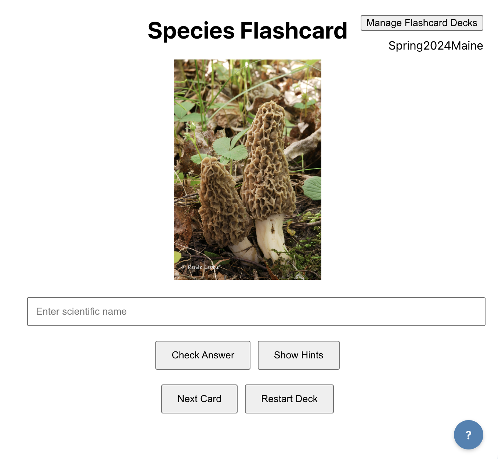

# Mushroom Flashcard Project

[

## Project Description

The Mushroom Flashcard program <a href="https://mushroomcards.pythonanywhere.com/)" target="_blank" rel="noopener noreferrer">Mushroom cards app</a> is designed to help newcomers identify mushrooms and learn the pronunciation of their scientific names.

This flashcard program helps you build a visual and auditory vocabulary for mushrooms by practicing identification and pronunciation within a dedicated deck. The central part of the user interface is shown above.

The goal is to type in the correct scientific name (as already done in the screenshot). Pressing "Hints" will show all the scientific names in the current deck. If you guess incorrectly three times, the correct name will be displayed. Once the correct name is given or after three incorrect guesses, a "Pronounce Name" button appears, along with a hyperlink to a webpage describing the mushroom.

The initial deck, "Spring2024Maine," was created by identifying the top 30 or so mushrooms with the highest number of iNaturalist research-grade observations in Maine from April to June 2024 (with a few morels added for fun). Other decks, including some from MMA foray lists, can be found by clicking the "Manage Flashcard Decks" button in the upper right corner. You can also load your own deck by providing a spreadsheet-like file with five columns (click the help icon in the bottom right corner for more information). The program runs best on a laptop or desktop computer.

The Mushroom Flashcard application is an early-stage, open-source project. We welcome ideas and suggestions from anyone. If you're interested in other mushroom quizzes, you might also want to check out the quiz program at <a href="https://www.mycoquebec.org/" target="_blank" rel="noopener noreferrer">MycoQuebec</a>. They offer a different question presentation style and have some interesting options, such as selecting a single taxonomic group.

## Installation Instructions for PythonAnywhere.com

These step-by-step instructions are an outline of installation of the React/Flask application on PythonAnywhere.com:

1.  **Create a PythonAnywhere Account:**
    * If you don't have one already, create a free or paid account on PythonAnywhere.com.

2.  **Open a Bash Console:**
    * Log in to your PythonAnywhere account and open a new Bash console.

3.  **Clone the Repository:**
    * Use the following command to clone the project repository:
        ```bash
        git clone <your-repository-url>
        ```
        (Replace `<your-repository-url>` with the actual URL of your GitHub repository.)

4.  **Navigate to the Frontend Directory:**
    * Use the following command to navigate to the frontend directory:
        ```bash
        cd <your-repository-name>/frontend
        ```
        (Replace `<your-repository-name>` with the name of your repository.)

5.  **Modify the .env.production File:**
    * Open the `.env.production` file using a text editor (e.g., `nano .env.production`).
    * Modify the `REACT_APP_API_URL` variable to point to your PythonAnywhere web app URL. For example:
        ```
        REACT_APP_API_URL=[https://your-username.pythonanywhere.com](https://www.google.com/search?q=https://your-username.pythonanywhere.com)
        ```
        (Replace `your-username` with your PythonAnywhere username.)
    * Save the file.

6.  **Create a React Build Directory:**
    * Navigate back to the root of your repository:
        ```bash
        cd ../
        ```
    * Run the `export.sh` script to create a React build directory inside the backend directory:
        ```bash
        sh ./export.sh
        ```

7.  **Set up a Virtual Environment (Recommended):**
    * Create a virtual environment for your backend:
        ```bash
        mkvirtualenv --python=python3.10 <your-virtualenv-name>
        ```
        (Replace `<your-virtualenv-name>` with a name for your virtual environment. If you don't have virtualenv installed, install it with `pip install virtualenv`.)
    * Activate the virtual environment:
        ```bash
        workon <your-virtualenv-name>
        ```
    * Navigate to the backend directory:
        ```bash
        cd backend
        ```
    * Install the required Python packages:
        ```bash
        pip install -r requirements.txt
        ```

8.  **Set up a PythonAnywhere Web App:**
    * Go to the "Web" tab on your PythonAnywhere dashboard.
    * Click "Add a new web app."
    * Select "Manual configuration."
    * Choose a Python version that matches your virtual environment.
    * In the "Working directory" field, enter the path to your backend directory (e.g., `/home/your-username/your-repository-name/backend`).
    * In the "WSGI configuration file" field, PythonAnywhere will create a default file. You will need to edit this file.
    * Edit the WSGI file to match the following:
        ```python
        import sys

        path = '/home/your-username/your-repository-name/backend'
        if path not in sys.path:
            sys.path.append(path)

        from app import app as application
        ```
        (Replace `your-username` and `your-repository-name` with your actual values. Replace `app` with the name of your flask app file.)
    * In the Static files section, add a new mapping:
        * URL: `/static/`
        * Directory: `/home/your-username/your-repository-name/backend/build/static/`
    * Click "Reload" to apply the changes.

Your application should now be running on your PythonAnywhere web app URL.

